# README
# Overview

1. Summary
2. Installation
3. Requirements
4. User Stories
5. Wireframing
6. Workflow Diagram
7. Entity Relationship Diagram
8. List of Tools Used
9. Project Plan
10. Future Updates
11. Code Review

------------------

Link : https://coinbay.cynicindustries.net/
## 1. Summary

PROBLEM DEFINITION

There is no legal equivalent alternative to eBay or Gumtree when it comes to dealing with cryptocurrencies.

SOLUTION

CoinBay is a 2-sided bitcoin only marketplace offering goods and services written in Ruby on Rails.

The problem this attempts to solve is to provide an above board and legal trading platform similar to eBay.

The USP for this project is quite simple, cryptocurrency is gaining a lot popularity and providing a trading platform for goods and services is a no brainer as there is no current competition in this space.

There are a few potential ethical issues, bitcoins fluctuating price and security regarding wallet management.

These issues will be addressed, the price of the goods or service will be hedged against the Australian Dollar and all payment operation will be handled by a 3rd party payment gateway system easing the burden of payment security.

-----------------------
## 2 Installation
Configuration - you will not have a `/config/local_env.yml` file as this has been ignored through Git. In order to run the App you will need to create a new `/config/local_env.yml` file and pre-fill it with the environmental variables listed below.

1. Clone the repo then change into the directory.
2. Run `bundle install` in terminal.
3. Run `rails db:migrate` in terminal.
4. Run `rails db:seed` in the terminal.

5. Create a 'local_env.yml' file in the /config/ directory of the app, then add these below.

```ruby
DB_USER: 'XXX' #Username for database
DB_PASSWORD: 'XXX' #Password for database
BINANCE_API_KEY: 'XXX' #Register an account on trading exchange binance.com and generate an API Key
BINANCE_SECRET_KEY: 'XXX' #Register an account on trading exchange binance.com and generate an API Secret
CLOUDINARY_API_KEY: 'XXX' #Register an account with cloudinary.com and generate an API Key
CLOUDINARY_SECRET_KEY: 'XXX' #Register an account with cloudinary.com and generate an API Secret
EXCHANGE_PASS: 'XXX' #SMTP password for your SMTP service`
```

6. Add this line of code to config/application.rb allow Rails to load the local_env.yml environment variables on startup.

```ruby
class Application < Rails::Application
  #Initialize configuration defaults for originally generated Rails version.
  config.load_defaults 5.1

config.before_configuration do
  env_file = File.join(Rails.root, 'config', 'local_env.yml')
  YAML.load(File.open(env_file)).each do |key, value|
    ENV[key.to_s] = value
  end if File.exists?(env_file)
```
  7. A BTC testnet wallet will be required for testing, you can create one at https://bitpay.com. Once created, you will need to send yourself some testnet coins to send payments unless you are planning to go live with btC right away. You can get test coins from this faucet here, https://testnet.manu.backend.hamburg/faucet.

--------------

## 3. Requirements
1. Create your application using Ruby on Rails
2. Demonstrate knowledge of Rails conventions.
3. Use postgresql database in development.
4. Use an API (eg. Omniauth, Geocoding, Maps, other..).
5. Use appropriate gems.
6. Use environmental variables to protect API keys etc.
7. Implement a payment system for your product.
8. Your app must send transactional emails (eg. using Mailgun).
9. Your app should have an internal user messaging system.
10. Your app will have some type of searching, sorting and or filtering capability.
11. Your app will have some type of file uploading capability (eg. images).
12. Your app will have authentication (eg. Devise, must have full functionality in place).
13. Your app will have authorisation (users have restrictions on what they can see and edit).
14. Your app will have an admin dashboard for the admin user to administrate the site.
15. Document your application with a README that explains how to setup, configure and use your application.

-----------------------
## 4. User Stories
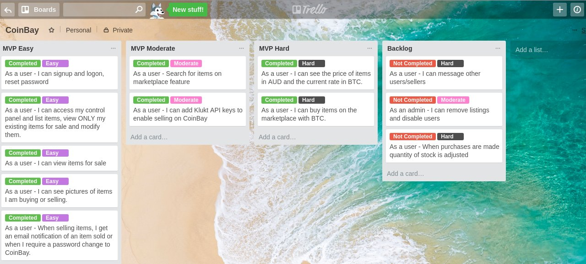

-----------------------

## 5. Wireframing

Logon/Signup
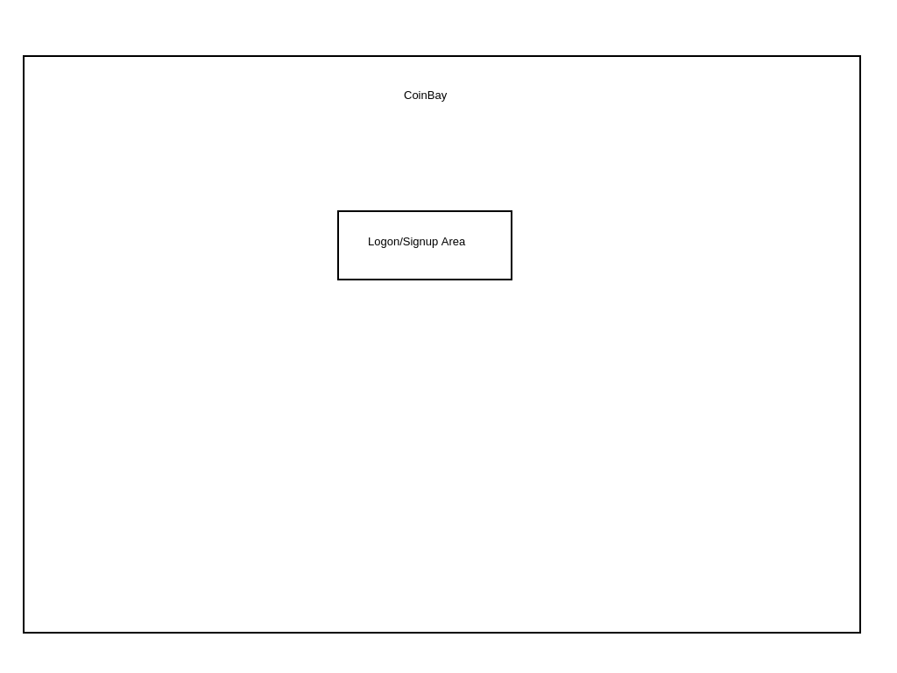

Marketplace
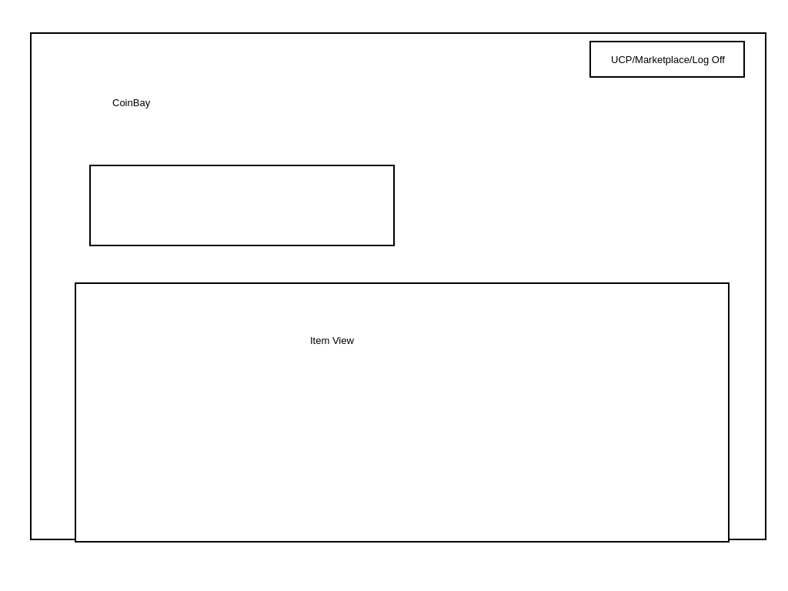

User Control Panel Dashboard
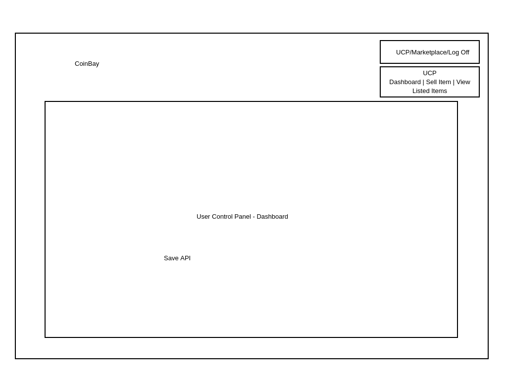

User Control Panel Sell Item
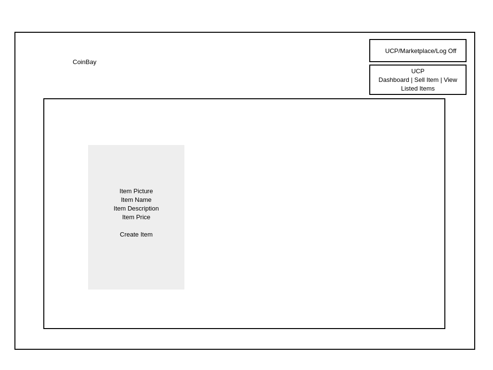

User Control Panel View Listed
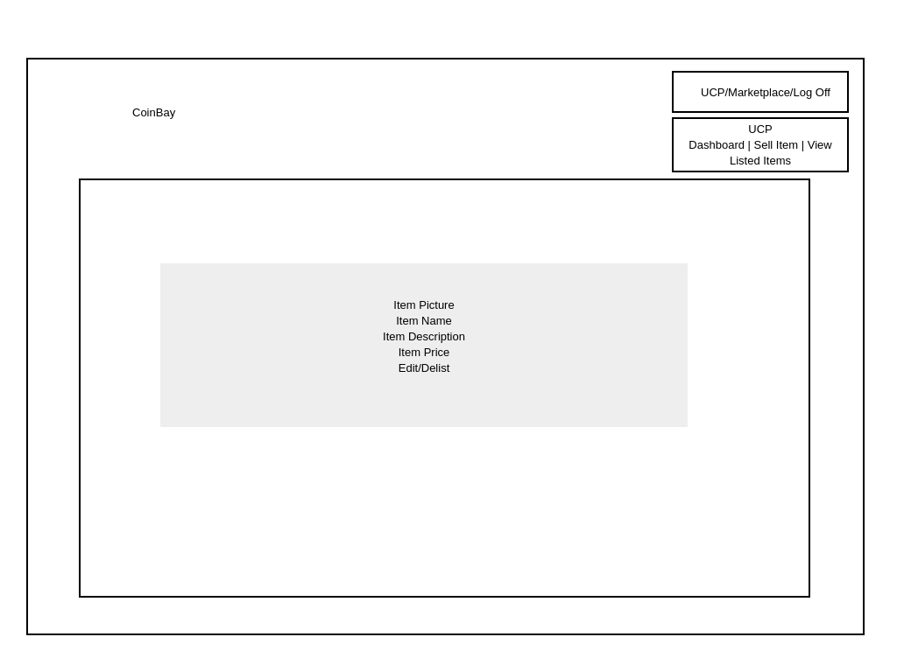

-----------------------

## 6. Workflow Diagram
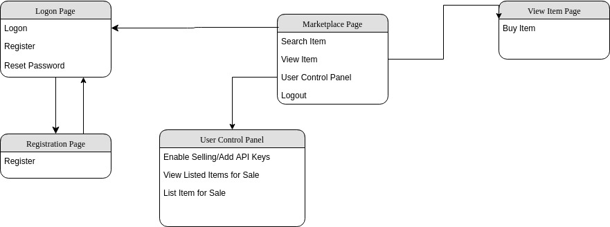

-------------

## 7. Entity Relationship Diagram
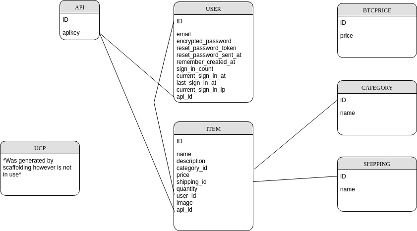

----------------

## 8. List of Tools Used
 1. Github - Version control, user stories and to assign story points for project management.
 2. postgresql - Database
 3. Devise - authentication
 4. Namecheap - domain purchase
 5. Microsoft DNS - DNS server
 6. Webhosting - Heroku
 7. Microsoft Exchange - emails
 8. Ruby-NTLM - email NTLM authentication
 9. Klukt - BTC payments
10. Pencil - wireframing
11. Draw.io - ERD and Flowchart
12. Cloudinary - image uploads
13. Binance - bitcoin price api


------------------

## 9. Project Plan
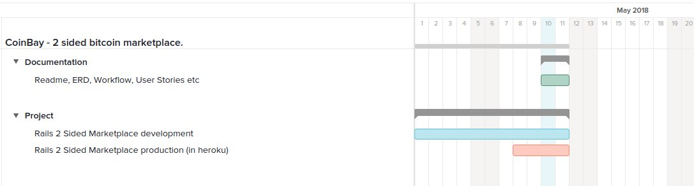

-------------------
## 10. Future Updates
1. Messaging within the app.
2. Quantity/Stock level control.

## 11. Code Review

1. Given a review.
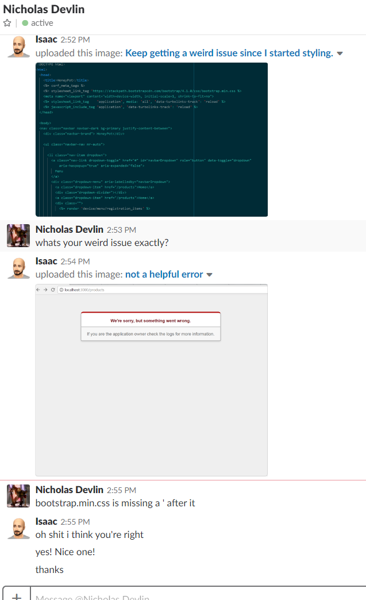

2. Recieved a review.
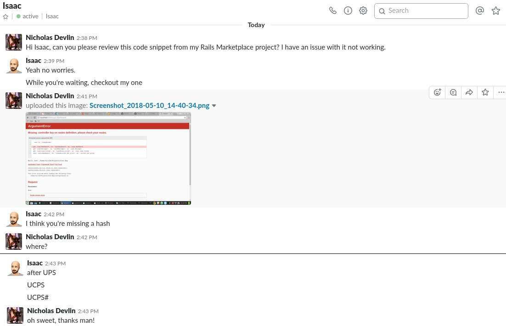
